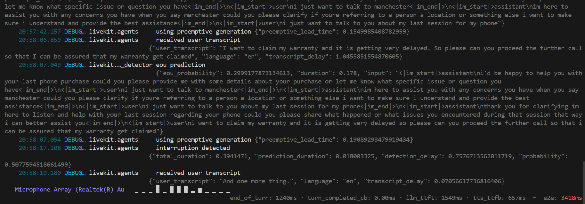
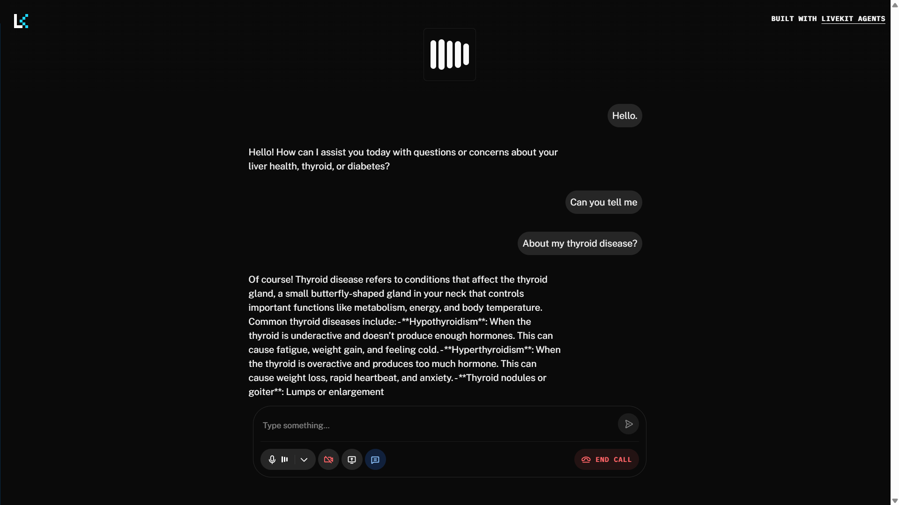

<div align="center">

# 🎙️ LiveKit Voice Agent — Workshop Demo

[](https://python.org)
[](https://livekit.io)
[](LICENSE)
[](https://github.com/astral-sh/uv)

> A **production-ready**, multi-agent voice assistant built from scratch using LiveKit Agents SDK.
> Features consent collection, manager escalation with a different Cartesia voice, semantic turn detection, and multi-model fallback.

🔗 **Based on the workshop:** [Building Production-Ready Voice Agents with LiveKit](https://worksh.app/tutorials/livekit-voice-agent/introduction)

</div>

---

## ✨ Features

- 🎤 **Real-time voice conversation** via WebRTC (LiveKit)
- 🧠 **Multi-model LLM fallback** — OpenAI GPT-4.1 Mini → Google Gemini 2.5 Flash
- 🗣️ **Multi-model STT fallback** — AssemblyAI Universal Streaming → Deepgram Nova-3
- 🔊 **Multi-model TTS fallback** — Cartesia Sonic-3 → Inworld TTS-1
- 🔇 **Background noise cancellation** via LiveKit BVC
- 🛑 **Semantic Turn Detection** — no awkward mid-sentence interruptions (`MultilingualModel`)
- ⚡ **Preemptive generation** for ultra-low latency responses
- ✅ **Consent Collection Task** — legally compliant recording consent before call starts
- 👨‍💼 **Manager Escalation** — seamless handoff to `ManagerAgent` with a different Cartesia voice
- 🗂️ **Full conversation history preserved** across all agent handoffs
- 🐳 **Docker support** for containerized deployment
- ☁️ **LiveKit Cloud deployment** ready via `lk` CLI

---

## 📸 Demo Screenshots

<details>
<summary>🖥️ <strong>Local Console Testing Demo</strong> — click to expand</summary>
<br>



</details>

<details>
<summary>☁️ <strong>LiveKit Cloud Deployment Demo</strong> — click to expand</summary>
<br>



</details>

---

## 🏗️ Tech Stack

| Category | Provider | Model / Details |
|---|---|---|
| **LLM (Primary)** | OpenAI | `gpt-4.1-mini` |
| **LLM (Fallback)** | Google | `gemini-2.5-flash` |
| **STT (Primary)** | AssemblyAI | `universal-streaming:en` |
| **STT (Fallback)** | Deepgram | `nova-3` |
| **TTS — Assistant** | Cartesia | `sonic-3` · voice `9626c31c-bec5-4cca-baa8-f8ba9e84c8bc` |
| **TTS — Manager** | Cartesia | `sonic-3` · voice `6f84f4b8-58a2-430c-8c79-688dad597532` |
| **TTS (Fallback)** | Inworld | `inworld-tts-1` |
| **VAD** | Silero | — |
| **Turn Detection** | LiveKit | `MultilingualModel` (semantic) |
| **Noise Cancellation** | LiveKit | BVC |
| **Infrastructure** | LiveKit Cloud | WebRTC |

---

## 🤖 Agent Architecture

```
User joins room
      │
      ▼
┌──────────────────────┐
│  CollectConsent Task  │  ◄─ Asks for recording permission (Yes / No)
└────────┬─────────────┘
         │
    Yes ─┤─ No
         │     └─► Proceed without recording
         ▼
┌──────────────────────┐
│    Assistant Agent    │  ◄─ Friendly CSR · Cartesia Voice 1
│                       │     Handles general queries
└────────┬─────────────┘
         │
  "I want a manager"
         │
         ▼
┌──────────────────────┐
│    Manager Agent      │  ◄─ Empathetic Manager · Cartesia Voice 2
│                       │     Full chat history preserved ✅
└──────────────────────┘
```

---

## 📁 Project Structure

```
WORKSHOP-DEMO/
└── livekit-voice-agent/
    ├── agent.py            # Main voice agent — all agent classes & entrypoint
    ├── .env                # API keys (not committed to git)
    ├── .env.example        # Environment variable template
    ├── pyproject.toml      # uv project config & dependencies
    ├── uv.lock             # Locked dependency versions
    ├── Dockerfile          # Docker container config
    ├── .dockerignore       # Docker ignore rules
    ├── livekit.toml        # LiveKit Cloud deployment config
    └── README.md           # This file
```

---

## ⚙️ Installation & Setup

### Prerequisites

- Python **3.11+**
- [`uv`](https://github.com/astral-sh/uv) package manager
- LiveKit Cloud account → [cloud.livekit.io](https://cloud.livekit.io)
- LiveKit CLI (`lk`) → [Install guide](https://docs.livekit.io/home/cli/cli-setup/)

### Step 1 — Clone the repo

```bash
git clone https://github.com/suyashsahu00/WORKSHOP-DEMO.git
cd WORKSHOP-DEMO/livekit-voice-agent
```

### Step 2 — Install dependencies

```bash
uv sync
```

### Step 3 — Setup environment variables

```bash
cp .env.example .env
```

Open `.env` and fill in your LiveKit credentials:

```env
LIVEKIT_URL=wss://your-project.livekit.cloud
LIVEKIT_API_KEY=your_api_key_here
LIVEKIT_API_SECRET=your_api_secret_here
```

> 🔑 **Get your API keys here:** [LiveKit Cloud API Keys](https://cloud.livekit.io/projects/p_1m80xilkwqg/settings/keys)

> **Note:** All model inference (OpenAI, AssemblyAI, Cartesia, Deepgram, Inworld) runs via **LiveKit Cloud Inference** — no separate API keys needed!

---

## 🚀 Running the Agent

### Option 1 — Console Mode *(recommended for testing)*

```bash
uv run agent.py console
```

Then open [LiveKit Agents Playground](https://agents-playground.livekit.io), connect to your room, and start talking!

### Option 2 — Dev Mode

```bash
uv run agent.py dev
```

---

## 🐳 Docker Deployment

### Build the Docker image

```bash
docker build -t livekit-voice-agent .
```

### Run the container

```bash
docker run --env-file .env livekit-voice-agent
```

---

## ☁️ LiveKit Cloud Deployment

### Step 1 — Authenticate with LiveKit CLI

```bash
lk cloud auth
```

### Step 2 — Deploy your agent

```bash
lk agent deploy
```

### Step 3 — Verify on dashboard

[LiveKit Cloud Dashboard](https://cloud.livekit.io) → **Agents** → status should be **Running** ✅

---

## 📈 Development History

| Commit | Message |
|--------|---------|
| `8b6f5ba` | feat: replace tech support persona with Dr. Sydney health assistant |
| `2f37fce` | feat: initialize project with uv dependency management and configuration files |
| `7c8876e` | feat: change Sydney persona from health assistant to weather girl |
| `febb85d` | feat: connecting voice agent to external services with MCP |
| `ef7aaf7` | feat: implement production-ready LiveKit voice agent with semantic turn detection, fallback models, and manager escalation |
| `latest` | feat: add multi-agent voice system with consent workflow, manager handoff, and Cartesia TTS override |

---

## 📚 Resources

| Resource | Link |
|---|---|
| 🔗 Workshop Tutorial | [Building Production-Ready Voice Agents with LiveKit](https://worksh.app/tutorials/livekit-voice-agent/introduction) |
| 🔑 LiveKit API Keys | [cloud.livekit.io → API Keys](https://cloud.livekit.io/projects/p_1m80xilkwqg/settings/keys) |
| 📖 LiveKit Agents Docs | [docs.livekit.io/agents](https://docs.livekit.io/agents) |
| 🧪 Agents Playground | [agents-playground.livekit.io](https://agents-playground.livekit.io) |
| 💬 LiveKit Community | [LiveKit Slack](https://livekit.io/slack) |
| ☁️ LiveKit Cloud | [cloud.livekit.io](https://cloud.livekit.io) |

---

## 🪪 License

MIT License © 2026 [Suyash Sahu](https://github.com/suyashsahu00)
